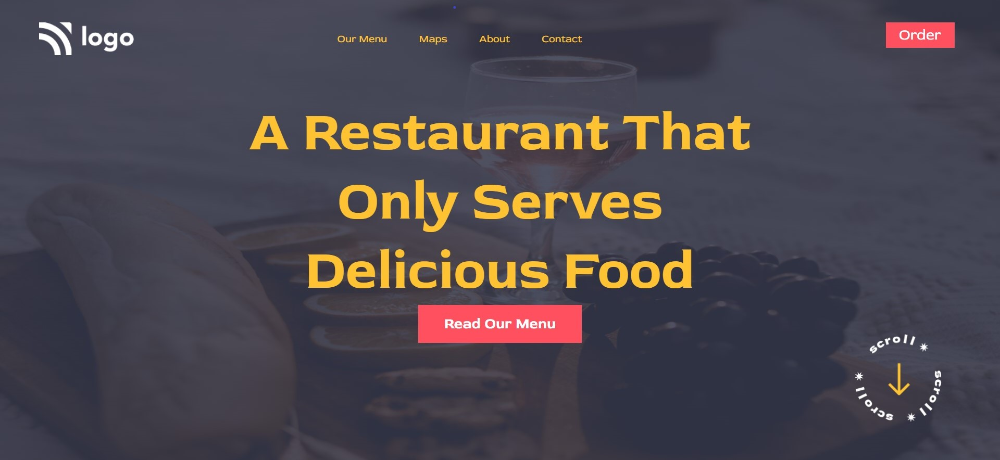

# Mohan Chindam

- It was a simple project compared to the first one.
- Wasted time, or you can say took 40% time to figure out the transparent coloring of the background image.
- Polished my positioning skills and some other skills. 
- I learned about coloring the background image.
- Took nearly one and half hours to two hours to complete this project as it was easier compared to the first one. 
- Reduced my trial and error problem in positioning or resizing elements.

- Below image shows the preview of the project:

Project is deployed on **Netlify**:
- You can preview the project here, [**Food Restaurant Home Page**]()

